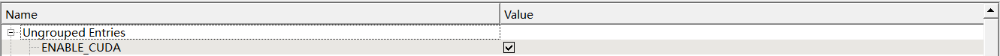

# Falcon_2023

- 2023年开始使用的新AI框架，希望拥有良好的跨平台能力
- 这里只存放入门资料，帮助快速完成编译和运行，并大致了解系统框架，更多资料：
	- [未走完的路](./TODO.md)
	- [前人的肩膀](./Document.md)

## 框架组成

- `3rdParty` -- 编译所用第三方库
- `bin` -- release版软件
	- `base` -- 可执行文件合集
	- `data` -- 重要参数和记录数据
	- `Formations` -- 机器人阵型文件
	- `Language` -- 国际化语言包
	- `Layout` -- 保存的界面排布设置
	- `LOG` -- log文件
	- `lua_scripts` -- lua脚本
	- `package.bat` -- QT自动打包脚本
	- `run.bat` -- 快捷运行程序脚本
- `cmake` -- cmake编译文件
- `Client` -- 可视化界面、调试工具、视觉处理模块
- `Core` -- 控制、决策算法
- `grSim` -- 物理仿真引擎
- `share` -- 共享代码

## 编译工具

- 软件
	- [Qt ≥ 5.15](https://www.qt.io/)
		- 需要用在线下载器下载，[在线下载器](https://jbox.sjtu.edu.cn/l/q1w86N)
	- [CMake](https://cmake.org/download/)
	- [Visual Studio](https://visualstudio.microsoft.com/zh-hans/?rr=https://www.microsoft.com/zh-cn/)
		- Visual Studio 2019, CMake ≥ 3.14
		- Visual Studio 2022, [CMake = 3.22](https://github.com/Kitware/CMake/releases/download/v3.22.0/cmake-3.22.0-windows-x86_64.msi)
- 依赖库
	- Eigen
	- kddockwidgets-1.5.0
	- lua
	- ODE
	- protubuf-3.17.2
	- tolua++
	- vartypes
	- zlib
	
## 编译方法
<!--
- Ubuntu(未尝试) : 具体编译方法见B站，搜索"Rocos环境配置",最后再加上下载Vartypes、KDDockWidgets
```bash
$ cd /tmp
$ git clone https://github.com/jpfeltracco/vartypes.git
$ cd vartypes
$ mkdir build
$ cd build
$ cmake ..
$ make
$ sudo make install
```
-->
- Windows : 
	- 注意检查是否有 3rdParty
	- **电脑上有多个版本 QT，特别是有 anaconda 的同学**，先修改 cmake/GetThirdParty.cmake 中的 QT 部分，输入电脑上的 QT 路径
		- set(CMAKE_PREFIX_PATH "D:/QT/5.15.2/msvc2019_64/lib/cmake/Qt5") 
	- 使用 CMake Gui，输入源代码所在目录和编译目录，如：
		- Where is the source code : D:/Falcon_2023
		- Where to build the binaries : D:/Falcon_2023/build
	- 直接 Configure
	- 完成后点击 Generate，再点击 Open Project
	- 在 vs 中选择 Release x64 模式
	- 开始生成，没有报错则完成
	- 运行 bin/package.bat，首次编译或更换 QT 路径时需删除 package.txt 重新输入路径,如：
		- Where is QT QML : D:\QT\5.15.2\msvc2019_64\qml
   		- Where is Client QML : D:\Falcon_2023\Client\src\qml
	- 如果发现 cmake 载入路径有误，则先点击菜单栏中的 File/Delete Cache，做有必要的调整后再重新 Configure 和 Generate
	- 如果觉得生成过慢，可以更改 cmake/Utils.cmake，之后重新 Configure 和 Generate。下述用了4核并行编译，可以查看电脑有几核，适当设置多些，但不建议给满
	```bash
	ProcessorCount(N)
    if(N GREATER_EQUAL 4)
    	set(N 4)
    endif()
    ```
	- 如果需要使用 GPU，将 cmake 中的 ENABLE_CUDA 置为 ON，~~按照 [wiki教程](https://gitlab.com/src-ssl/src/-/wikis/Algorithm/加入cuda的falcon编译) 配置~~，[cuda 12.0下载](https://jbox.sjtu.edu.cn/l/I1f4um)
	

## 开发须知

- .proto .pkg 文件修改后需要重新 cmake 生成接口文件
- git push 前，注意将以下配置归为默认值：
	- ~~gpuBestAlgThread.cpp 中，#define has_GPU false~~
	- 并行编译所用核数为4
	- 关闭 Client 的 Debug 信息，在 Client/CMakeLists.txt 中都不要注释
	```bash
	if (WIN32)
    message(${CMAKE_C_FLAGS})
    set(CMAKE_EXE_LINKER_FLAGS "${CMAKE_EXE_LINKER_FLAGS} /ENTRY:mainCRTStartup")
    set(CMAKE_EXE_LINKER_FLAGS "${CMAKE_EXE_LINKER_FLAGS} /SUBSYSTEM:WINDOWS")
	endif()
	```
- 国际化语言包：Client 每次编译后文件夹中都会生成 zh_CN.ts，这属于临时文件，不会上传到 git。生成 .qm 文件后将两者都复制到 bin/Language 里面，便于查错
  - [Linguist入门参考](https://gitlab.com/src-ssl/src/-/wikis/Software/Qt%E5%A4%9A%E8%AF%AD%E8%A8%80%E5%88%87%E6%8D%A2%E7%9A%84%E5%AE%9E%E7%8E%B0)

## 使用方法

- 启动 run.bat
- 拖动调整界面排布到适合的形式或直接读入更好的 Layout
- 开启新的分界面在 Widget 里面选择，RemoteControl中将 ControlMode 拨至右侧支持 xBox 手柄控制
- Help/Language 切换语言
- 键盘快捷键 “r” 重新载入某一参数文件 (*.ini)
- 其他操作与 [owl2操作手册](https://gitlab.com/src-ssl/src/-/wikis/Software/owl2操作手册) 中类似

## 常见问题

- 如果软件不正常退出，重新打开后先Kill进程，杀掉未关闭的进程后再开启软件
- 裁判盒指令无法接入，需核查网络配置，虚拟机需将网络设置为桥连模式
- 下车的时候数字键/Ctrl+数字键，待软件反应后再做其他操作，否则容易崩溃
- 当分界面脱离主界面时，一些键盘快捷键会失效，需要将分界面拖回主界面
